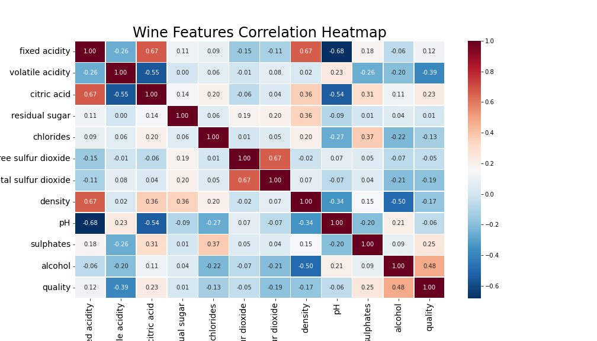
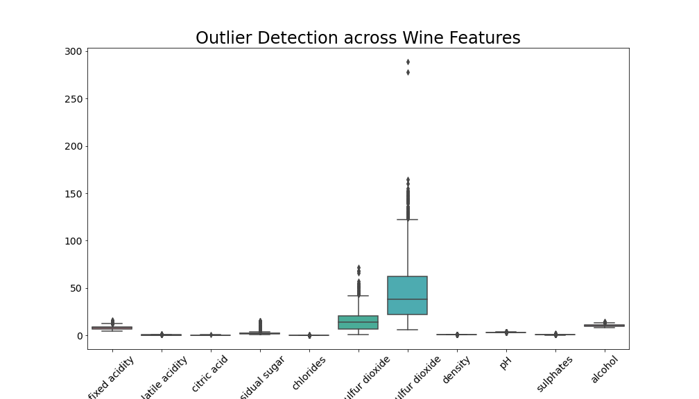
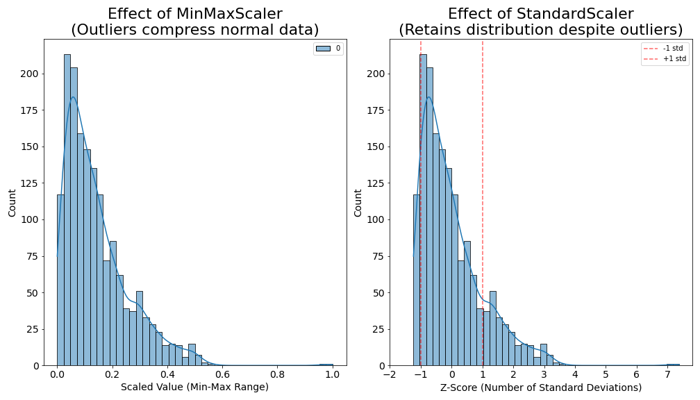
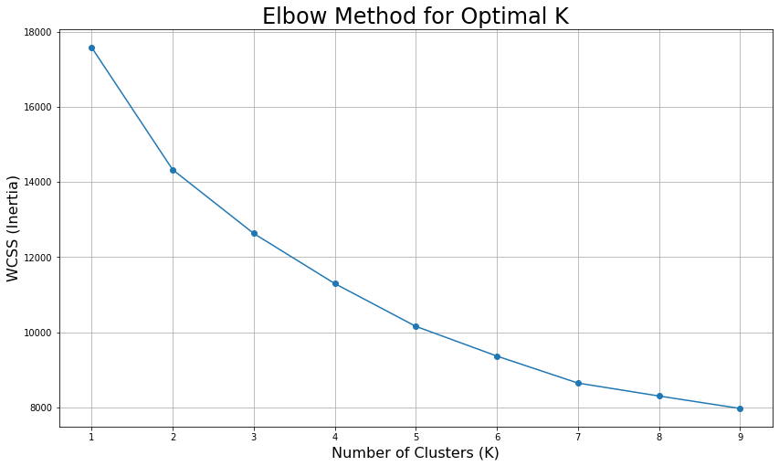
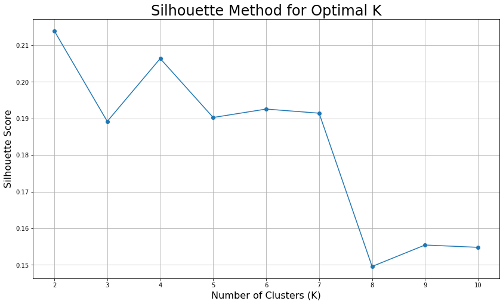
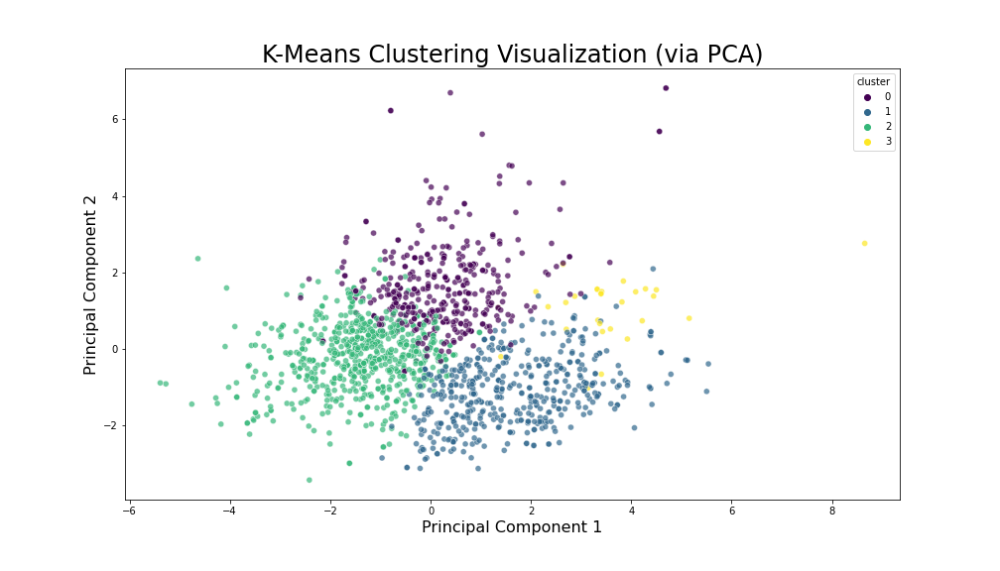
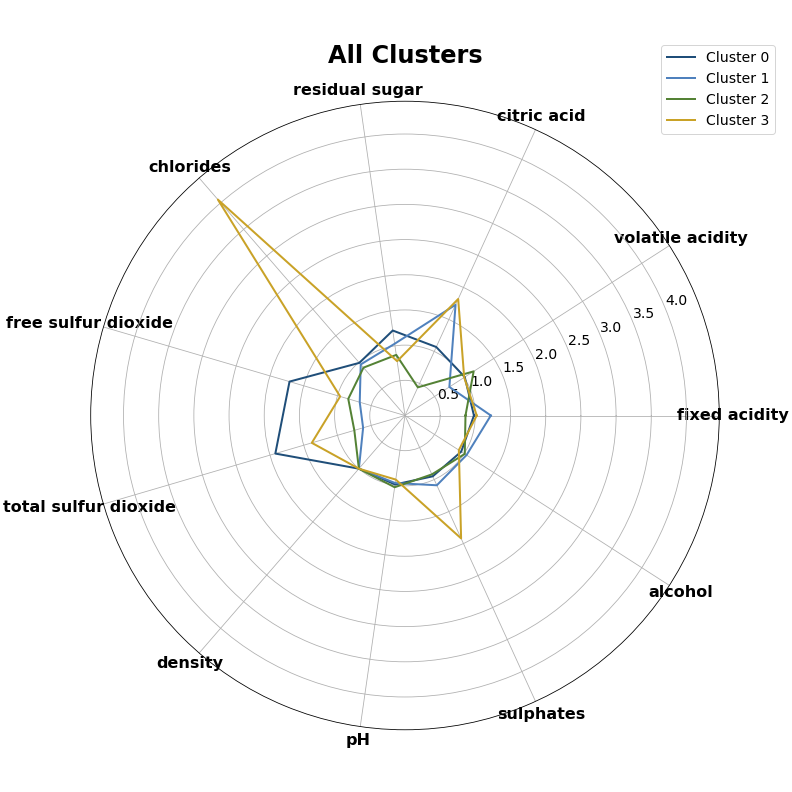
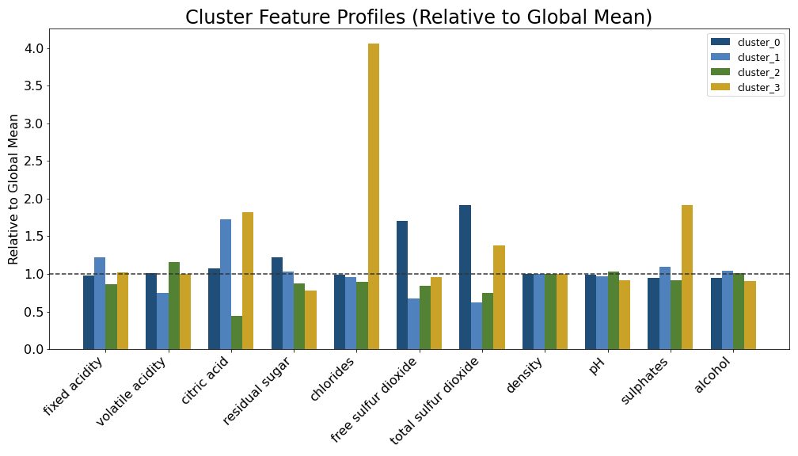
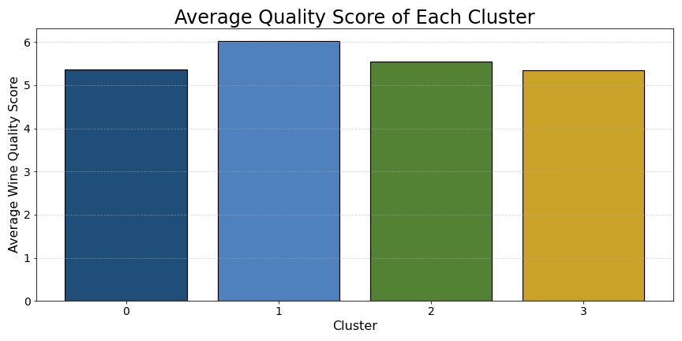
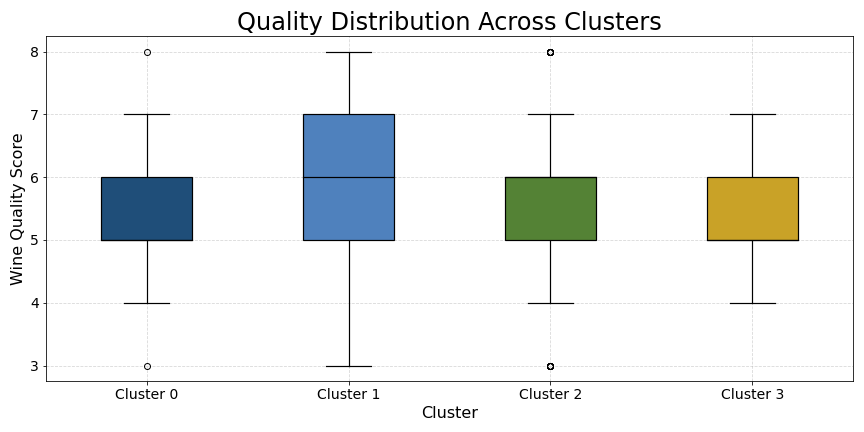

# 🍷 wine_insights
## _A deep dive into wine chemical characteristics using unsupervised learning and exploratory data analysis (EDA)._
---

## 🎯 Research Objective
This repository contains the research and experimental phase of the Wine project. The goal is to identify hidden patterns and flavor profiles in wine through chemical feature clustering, providing the analytical foundation for the `wine_expert` AI system.

---

## 🧪 Methodology & Workflow
### 1. Exploratory Data Analysis (EDA)
- Feature Correlation: Investigating how chemical properties like `alcohol`, `volatile acidity`, and `sulphates interact`.
- Outlier Detection: Using boxplots and Z-scores to ensure data quality before modeling.

### 2. Unsupervised Learning (Clustering)
- Algorithm: K-Means Clustering.
- Optimal K Selection: Determined using the Elbow Method and Silhouette Score to ensure distinct and meaningful groupings.
- Dimensionality Reduction: Utilizing PCA (Principal Component Analysis) to visualize high-dimensional chemical data in 2D/3D space.
---

## 📈 Key Insights & Visualizations
- ### Data Engineering & Preprocessing Logic
To ensure the clustering model (K-Means) accurately captures wine profiles, the following preprocessing workflow was implemented:

### 1. Feature Interaction & Selection
Using the **Correlation Heatmap**, I identified key chemical drivers. This exploratory step ensured that we retained features with the highest impact on wine characteristics while being aware of multi-collinearity between acid-related features.
<p align="center">  </p>

### 2. Strategic Scaling for Robustness 
The **Boxplot analysis** revealed significant outliers. To handle this without losing valuable extreme-case data, I compared two scaling methods on the `total sulfur dioxide` feature:
* **StandardScaler (Chosen)**: Maintains the distribution shape and prevents normal data from being compressed, which is vital for distance-based clustering.
* **MinMaxScaler (Rejected)**: Visualized as a "failure case" where outliers caused the majority of data to collapse into a narrow range (0-0.2).

<table style="width: 100%;">
  <tr>
    <td style="width: 50%; text-align: center;">
      
    </td>
    <td style="width: 50%; text-align: center;">
      
    </td>
  </tr>
</table>

### 3. Connection to Unsupervised Learning
The cleaned and Z-score normalized dataset was then fed into the **K-Means algorithm**. Because of the preprocessing steps above, the resulting clusters represent genuine chemical profiles rather than artifacts of unscaled data.

---
 ## 🤖 Unsupervised Learning: Clustering Analysis
 ### 1. Determining Optimal Clusters ($K$)
To identify the natural groupings within the wine dataset, I employed two validation metrics:

- Elbow Method: Observed the "Within-Cluster Sum of Squares" (WCSS). A clear bend is visible, suggesting $K=3$ or $K=4$ as the elbow point.
- Silhouette Method: Evaluated the separation distance between clusters. The peak score confirms that $K=4$ provides the most cohesive and distinct groupings.

<table style="width: 100%;">
  <tr>
    <td style="width: 50%; text-align: center;">
      
    </td>
    <td style="width: 50%; text-align: center;">
      
    </td>
  </tr>
</table>

### 2. Cluster Visualization via PCA
Since the data has 11 dimensions, I applied Principal Component Analysis (PCA) to project the clusters into a 2D space.
- Insight: The 4 clusters are well-separated in the PCA plane, proving that the chemical features we scaled with `StandardScaler` successfully formed distinct "wine personalities."
<p align="center">  </p>

### 3. Cluster Profiling: Defining "Wine Personalities"
By analyzing the Radar Chart and Feature Bar Chart, we can define the unique characteristics of each group:
- Cluster 0 (Dark Blue) - "The Balanced Standard": Shows average values across most features, representing the typical profile of the dataset.
- Cluster 1 (Blue) - "The High Alcohol & Quality": Notable for higher alcohol content and higher quality scores.
- Cluster 2 (Green) - "The High Acidity": Features significantly higher fixed acidity and citric acid.
- Cluster 3 (Gold) - "The High Sulfur Dioxide": This group contains wines with exceptionally high total sulfur dioxide, likely a specific style or preservation method.

<table style="width: 100%;">
  <tr>
    <td style="width: 50%; text-align: center;">
      
    </td>
    <td style="width: 50%; text-align: center;">
      
    </td>
  </tr>
</table>

### 4. Quality Correlation Validation
Finally, I checked the quality distribution for each cluster. Even though the model was unsupervised (it never saw the "quality" label), it successfully grouped wines with different quality potentials, with Cluster 1 showing a clear lead in median quality score.

<table style="width: 100%;">
  <tr>
    <td style="width: 50%; text-align: center;">
      
    </td>
    <td style="width: 50%; text-align: center;">
      
    </td>
  </tr>
</table>

---

## ⚙️ Installation & Setup

### 1. Virtual Environment Setup:
```bash
python -m venv venv
source venv/bin/activate  # Windows use: venv\Scripts\activate
```

### 2. Install dependencies:
```bash
pip install -r requirements.txt
```
---

## 📂 Project Architecture
```text
wine_insights_da/
├── assets/                   # Visualizations used in README
├── data/                     # Raw datasets
├── wine_insights_da.ipynb    # Jupyter Notebooks for analysis
├── requirements.txt          # Project dependencies
└── README.md                 # Project documentation & setup guide
```

---

## 🚀 Usage
1. Open the Jupyter Notebook: `jupyter notebook`
2. Run `notebooks/wine_analysis.ipynb` to see the full data exploration, scaling comparison, and clustering process.
---

## 📊 Data Source
The dataset used in this research is the **Red Wine Quality Dataset**, originally from the UCI Machine Learning Repository and hosted on [Kaggle](https://www.kaggle.com/datasets/uciml/red-wine-quality-cortez-et-al-2009).

---

### 🛠️ Tech Stack
- Languages: Python
- Libraries: `Pandas`, `NumPy`, `Scikit-learn`, `Matplotlib`, `Seaborn`
- Notebooks: Jupyter Notebook for step-by-step experimentation.

---
## 🔗 Related Projects
* [Wine_Expert (AI System)](https://github.com/JungFenChang/wine_expert_ai): The results of this analysis are used in the `Wine_Expert` project for chemical flavor analysis of wines.